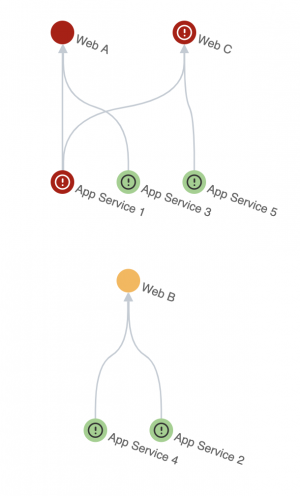
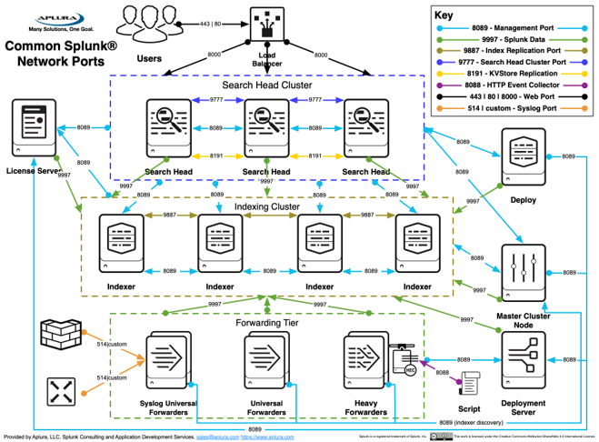
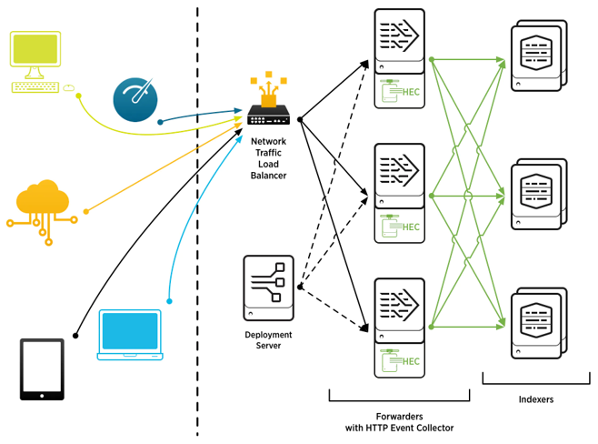
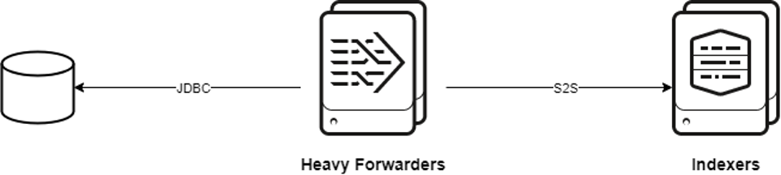
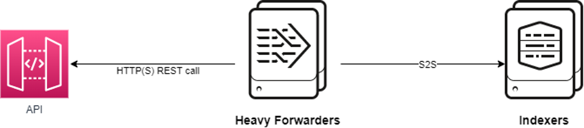
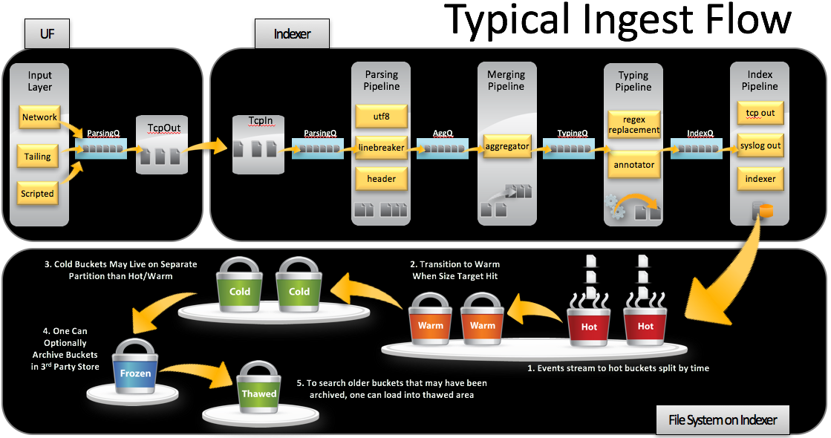
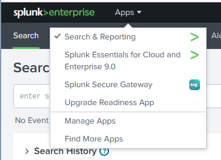

<!-- _footer: 'https://github.com/cmeerbeek/splunk-workshop-slides' -->

# Splunk for DevOps Engineers
###  Coen Meerbeek

---

## Coen Meerbeek
### Product Owner and Splunk enthusiast Schiphol & self-employed

<i class="fa-brands fa-twitter"></i> Twitter: @cmeerbeek
<i class="fa-brands fa-mastodon"></i> Mastodon: @cmeerbeek@mastodon.green
<i class="fa-brands fa-linkedin"></i> LinkedIn: - [Coen Meerbeek](https://linkedin.com/in/cmeerbeek/)
<i class="fa fa-window-maximize"></i> Blog: [https://coenm.nl/](https://coenm.nl/)
<i class="fa-brands fa-github"></i> GitHub: [cmeerbeek](https://github.com/cmeerbeek)

--- 

# Agenda

- Splunk components
- Getting data in
- Quiz!
- Getting data out
- Assignments

--- 

# Splunk basic concepts

---

# Splunk portfolio

---

# Splunk Enterprise Security (ES)

* Separate (premium) module/app installed on a Splunk SHC
Owned, maintained and used by Incident Response Teams
* ES contains pre-built and custom correlation searches which search through all the data in Splunk looking for security risks/incidents and triggers a notable event
* A notable event is researched by a IRT member and followed-up if needed

---

# Splunk IT Service Intelligence (ITSI)

* Service / KPI monitoring solution (also a premium app)
* Uses the same data in Splunk Enterprise

---

# Splunk instances and deployments

---

# Splunk main instance types

* **Indexers** -> Splunk instance on which the data is stored (multiple Indexers run in an Index Cluster)
* **Search Head** -> Splunk instance where you as a user logon to and execute searches, open dashboards and schedule searches for alerts (multiple Search Heads run in a Search Head Cluster)
* **Deployment Server** -> Splunk instance that allows forwarder to get configuration from a central location (pull not push)
* **Search Head Cluster Deployer** -> Splunk instance to push config to a Search Head Cluster
* **Manager Node** -> Splunk instance to manage config and state of an Index Cluster

---

# Splunk agent software

* Splunk agents are called forwarders
* **Universal Forwarder** -> lightweight agent installed on *nix and windows systems to ingest data
* **Heavy Forwarder** -> Splunk instance which can ingest and retrieve data from other sources (e.g. REST API calls, DBconnect, HEC)

---

# Splunk departemental deployment

---

# Splunk full-blown deployment

---

# Mapreduce and Splunk

1. Universal forwarder reads/watches a logfile
2. Content of the file is sent to an Indexer
3. Each 30 seconds or when there is a pause in the content the forwarder switches to another Indexer
4. Content of the file is split across all Indexers
5. User triggers a search on an Search Head
6. Search Head distributes the search to all Indexers
7. Each Indexer returns the part of the content that they have
8. Search Head merges the content and shows it to the user

---

# Getting data in

---

# Splunk universal forwarder

---

# Splunk HTTP Event Collector

---

# Splunk DBConnect

---

# Splunk REST API

---

# Where does the data go?

* Data is stored on the filesystem of an **indexer** (no database)
* Data is stored in an **index**
* An index is a grouping of data for a certain service or technology
* Split indexes if access needs to be prevented or if you need different timeranges of the data
* Metadata is stored which includes source, sourcetype, _time and _indextime (more on fields later)
  * Source -> usually name of the file
  * Sourcetype -> identifies the type data (yours to choose)
  * _time -> timestamp of the event as parsed by Splunk
  * _indextime -> timestamp of the time the event got indexed

---

# Access the data

* Splunk has 2 types of roles
  * Access to data
  * Capabilities in Splunk itself
* Each index in Splunk usually has one role attached to it for data access
* Capabilities can be:
  * User: Search data and use knowledge objects
  * Power: Search data and create/update knowledge objects
  * Admin: :-)
* If you want to become power user follow: https://education.splunk.com/pathway/foundation-fast-start

---

# Splunk indexer pipelines

---

# Splunk license

* Splunk license is not cheap, you pay for the amount of GB you ingest per day across your whole Splunk platform
* The number of instances doesn't matter (Forwarders, Search Heads or Indexers)
* Splunk is working on a license model based on the infrastructure but it's not common

---

# Test your skills in the quiz!

---

# Getting data out

---

# Splunk Query Language

* Also called SPL
* Follows a fixed pattern
  * Get the events you need
  * Transform the data / add fields
  * Display the data
* [Quick reference](https://www.splunk.com/pdfs/solution-guides/splunk-quick-reference-guide.pdf)
* Let me walk you through the UI and some basic searches!

---

# Knowledge Objects

Apps / Dashboards / Reports / Alerts / Data Models / Lookups

---

# Knowledge Objects I

## Apps

* Combination of search time configuration and/or knowledge objects
* Can be background configuration like field aliases
* Can be dashboards
* Can be alerts
* Etc.

---

## Knowledge Objects II

## Dashboards

Search driven panels with SimpleXML sourcecode

There is also a dashboard studio which allows much more customization but most companies still use SimpleXML

## Reports

Resultset for a given query which can be scheduled and send via email as PDF or used to drive a dashboard with improved performance

---

## Knowledge Objects III

## Alerts

Scheduled search where based on alert condition alert actions can be triggered

---

## Knowledge Objects IV

## Data Models

* Layer on top of results to give to data analysts who have experience with Excel or PowerBI like solutions but not with SPL
* Can also be accelerated if based on HUGE amounts of data (e.g., firewall logs)
* Samples; Web Server, Network
* Based on Common Information Model (CIM)
  * A pre-defined set of fields which are mapped on the data
  * For example, all firewall logs from all vendors need to map to src_ip field instead of srcip/sourceip/etc.

---

## Knowledge Objects V

## Lookups

* Database like tables available to enrich search results or drive dashboards
* For example, add descriptions to HTTP status codes
  
* Types
  * CSV -> plain textfile
  * KVstore -> internal No-SQL database