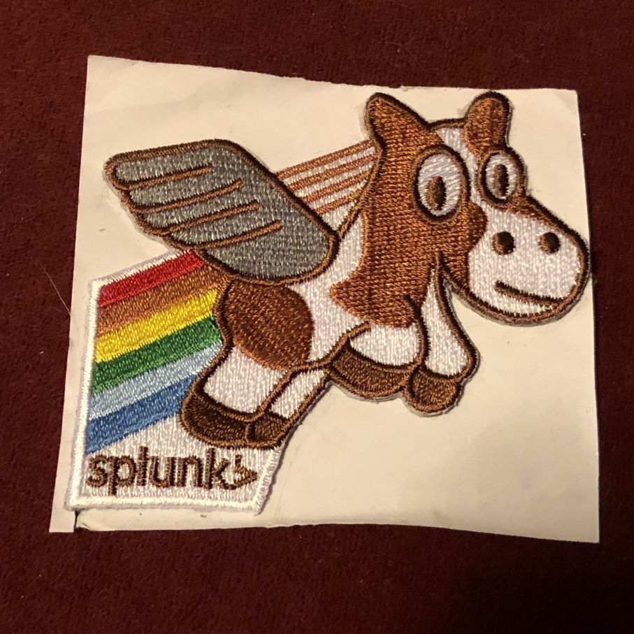
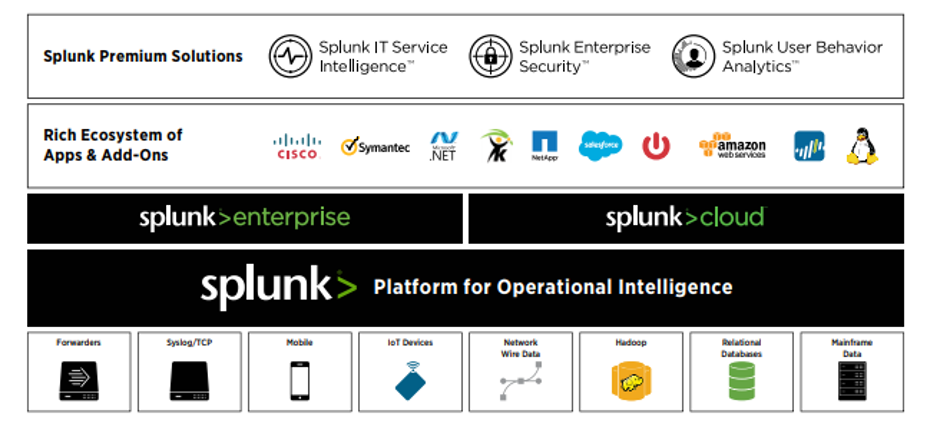

<!-- _footer: 'https://github.com/cmeerbeek/splunk-workshop-slides' -->

# Splunk for DevOps Engineers
###  Coen Meerbeek

---

## Coen Meerbeek
### Product Owner and Splunk enthusiast Schiphol & self-employed

<i class="fa-brands fa-twitter"></i> Twitter: @cmeerbeek
<i class="fa-brands fa-mastodon"></i> Mastodon: @cmeerbeek@mastodon.green
<i class="fa-brands fa-linkedin"></i> LinkedIn: - [Coen Meerbeek](https://linkedin.com/in/cmeerbeek/)
<i class="fa fa-window-maximize"></i> Blog: [https://coenm.nl/](https://coenm.nl/)
<i class="fa-brands fa-github"></i> GitHub: [cmeerbeek](https://github.com/cmeerbeek)

--- 

# Agenda

- Splunk components
- Getting data in
- Quiz!
- Getting data out
- Assignments

--- 

# Splunk basic concepts

---

# Splunk portfolio

---

# Splunk instances and deployments

---

# Splunk main instance types

* **Indexers** -> Splunk instance on which the data is stored (multiple Indexers run in an Index Cluster)
* **Search Head** -> Splunk instance where you as a user logon to and execute searches, open dashboards and schedule searches for alerts (multiple Search Heads run in a Search Head Cluster)
* **Deployment Server** -> Splunk instance that allows forwarder to get configuration from a central location (pull not push)
* **Search Head Cluster Deployer** -> Splunk instance to push config to a Search Head Cluster
* **Manager Node** -> Splunk instance to manage config and state of an Index Cluster

---

# Splunk agent software

* Splunk agents are called forwarders
* **Universal Forwarder** -> lightweight agent installed on *nix and windows systems to ingest data
* **Heavy Forwarder** -> Splunk instance which can ingest and retrieve data from other sources (e.g. REST API calls, DBconnect, HEC)

---

# Splunk departemental deployment

---

# Splunk full-blown deployment

---

# Mapreduce and Splunk

1. Universal forwarder reads/watches a logfile
2. Content of the file is sent to an Indexer
3. Each 30 seconds or when there is a pause in the content the forwarder switches to another Indexer
4. Content of the file is split across all Indexers
5. User triggers a search on an Search Head
6. Search Head distributes the search to all Indexers
7. Each Indexer returns the part of the content that they have
8. Search Head merges the content and shows it to the user

---

# Getting data in

---

# Splunk universal forwarder

---

# Splunk HTTP Event Collector

---

# Splunk DBConnect

---

# Splunk REST API

---

# Where does the data go?

* Data is stored on the filesystem of an **indexer** (no database)
* Data is stored in an **index**
* An index is a grouping of data for a certain service or technology
* Split indexes if access needs to be prevented or if you need different timeranges of the data
* Metadata is stored which includes source, sourcetype, _time and _indextime (more on fields later)
* * Source -> usually name of the file
  * Sourcetype -> identifies the type data (yours to choose)
  * _time -> timestamp of the event as parsed by Splunk
  * _indextime -> timestamp of the time the event got indexed

---

# Access the data

* Splunk has 2 types of roles
  * Access to data
  * Capabilities in Splunk itself
* Each index in Splunk usually has one role attached to it for data access
* Capabilities can be:
  * User: Search data and use knowledge objects
  * Power: Search data and create/update knowledge objects
  * Admin: :-)
* If you want to become power user follow: https://education.splunk.com/pathway/foundation-fast-start

---

# Splunk indexer pipelines

---

# Splunk license

* Splunk licence is not cheap, you pay for the amount of GB you ingest per day across your whole Splunk platform
* The number of instances doesn't matter (UF's, SH's or IDX's)
* Splunk is working on a license model based on the infrastructure but it's not common